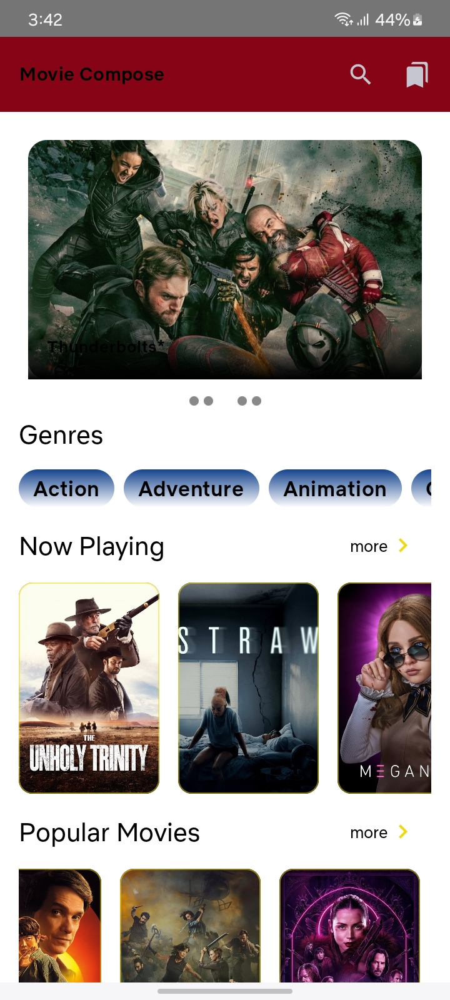
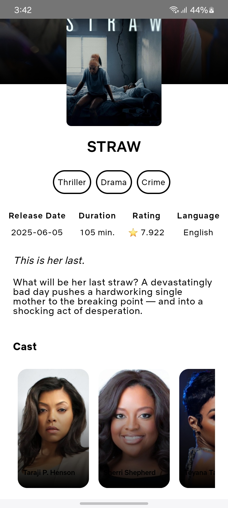
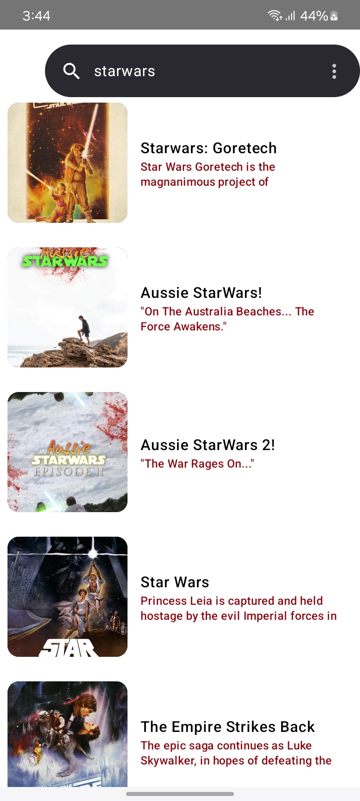

# 🎬 Movie Compose App

A modern Android application that displays a collection of movies fetched from a remote API. Built with the latest Android technologies such as **Jetpack Compose**, **MVVM Architecture**, **Dagger Hilt**, **Retrofit**, **Room**, and **Paging 3**.

  
 
  
  
  
  

---

## 🔧 Tech Stack

| Technology        | Description                                      |
|-------------------|--------------------------------------------------|
| **Kotlin**         | Primary programming language                    |
| **Jetpack Compose**| Declarative UI framework                        |
| **MVVM**           | Architecture pattern (Model-View-ViewModel)     |
| **Dagger-Hilt**    | Dependency Injection                            |
| **Retrofit**       | HTTP client for network calls                   |
| **Room**           | Local database storage                          |
| **Paging 3**       | Efficient paging of movie lists                 |
| **Coil**           | Image loading in Compose                        |

---

## 📱 Features

- 🎞️ Automatic sliding banner for latest movies
- 📂 Genre-wise movie browsing with paging
- 🔍 Search functionality with live filtering
- ❤️ Wishlist support (Room DB)
- 📑 Movie details screen with overview and rating
- 🧭 Jetpack Compose Navigation

---

## 🧱 App Architecture

This app follows clean **MVVM architecture**:
- **UI (View)**: Composables using state flows from ViewModel
- **ViewModel**: Manages UI logic and state
- **Repository**: Handles data operations (network and local)
- **Data Source**: Retrofit API & Room DAO
- **Model**: Kotlin data classes for Movie, Genre, etc.

UI (Compose)
↓
ViewModel
↓
Repository
↓
Remote (Retrofit) / Local (Room)

---

## 🚀 Getting Started

### Prerequisites

- Android Studio Hedgehog or newer
- Minimum SDK 23+
- An active internet connection
- (Optional) [TMDb API key](https://www.themoviedb.org/documentation/api)

